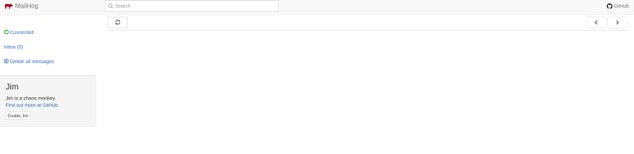

# Docker Skeleton for Symfony Projects

This skeleton will provide a complete development environment for your Symfony project. 

##### This setup contains
* MySQL Database
* Nginx configuration (tested for Symfony 4 and 5 applications)
* PHP-FPM 7.2
* Composer, npm and yarn
* MailHog as mail emulator

##### Tech Stack:
* Ubuntu 18.04
* Docker Community 19
* Symfony 4 or 5
* PHPSTORM as IDE

## Setup Steps

### 1. Change docker-composer file for debugging with XDebug
Change the values of `XDEBUG_CONFIG` and `PHP_IDE_CONFIG`

You can get your hostname from the console. You'll need it for set up remote debugging with XDebug.

For `PHP_IDE_CONFIG` choose a project name. This will be the name for you PHP Debug Server (Setting in PHPSTORM)

Adapt `PHP_XDEBUG_REMOTE_PORT`. I use 9999 as remote port. You need to change the debugging port in PHPSTORM settings 
as well.

### 2. Copy your project to the project folder
You can either clone/copy an existing project or create a new one with Symfony.

##### Create with Composer
* start docker container 
* run `docker-compose build`
* run `docker-compose up -d`
* go into the PHP container `docker-compose exec php bash`
* `/usr/local/bin/composer create-project symfony/website-skeleton . 4.4.*`
* `chown -R www-data:www-data .`

##### Clone repository into project folder

* if you're in the root directory run `git clone <REPOSITORY_URL> project`

### 3. Change .env file

* set database URL 
`DATABASE_URL=mysql://database_user:12345678@db:3306/database`

* set mailer URL 
`MAILER_URL=smtp://mailhog:1025`

### 4. Start your container

* Run `docker-compose build` to build the PHP image.

* Run `docker-compose up -d` to start all containers.

### 5. Open your application

You can reach your Symfony app at http://localhost:8080

At http://localhost:8025/ you'll reach the MailHog Frontend

